# RNode Firmware User Manual

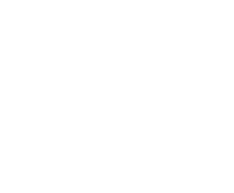
An RNode is a small portable device used as a LoRa-radio interface to communicate via [Reticulum Network Stack](https://reticulum.network/).

This manual covers the [rns.moscow](https://rns.moscow) [fork](https://flasher.rns.moscow) of Mark Qvist's [RNode_Firmware](https://github.com/markqvist/RNode_Firmware). This firmware has expanded on the features and device support of the original firmware while staying fully backwards-compatible. The LoRa radio subsystem implementation hasn't been changed and it still uses the original SX-series driver code by Mark. For a quick overview of what this fork adds on top of upstream, see the [README](../README.md).

<div style="clear:both;"></div>

## Table of Contents

1. [Getting Firmware Onto a Device](#getting-firmware-onto-a-device)
2. [Supported Devices](#supported-devices)
3. [Main Screen](#main-screen)
4. [Navigation](#navigation)
5. [RNode Settings Menu](#rnode-settings-menu)
6. [URNS (microReticulum) Support](#urns-microreticulum-support)
7. [LXMF Messenger](#lxmf-messenger)
8. [Radio Settings](#radio-settings)
9. [ESP-NOW Interface](#esp-now-interface)
10. [WiFi](#wifi)
11. [Buzzer/Beeper Support](#buzzerbeeper-support)
12. [Rotary Encoder Support](#rotary-encoder-support)
13. [NeoPixel Status LED](#neopixel-status-led)
14. [Hardware](#hardware)
15. [Bluetooth](#bluetooth)
16. [Bluetooth/BLE Pairing](#bluetoothble-pairing)
17. [BLE Keyboard Support](#ble-keyboard-support)
18. [Wired Ethernet (W5500) Support](#wired-ethernet-w5500-support)
19. [GNSS Receiver Support](#gnss-receiver-support)
20. [RTC Clock](#rtc-clock)
21. [Environment Sensor Support](#environment-sensor-support)
22. [OTA Firmware Update Support](#ota-firmware-update-support)
23. [Promiscuous LoRa Mode Support / Packet Analyzer](#promiscuous-lora-mode-support-packet-analyzer)
24. [WebSocket & TCP/IP KISS Interface](#websocket-tcpip-kiss-interface)
25. [Building From Source](#building-from-source)
26. [Attribution & Credits](#attribution-credits)

---

## Getting Firmware Onto a Device

### The Web Flasher

[flasher.rns.moscow](https://flasher.rns.moscow) flashes pre-built firmware to most of the boards in this fork directly from the browser over USB (WebSerial) - no toolchain install required. This is the recommended path for most users; it also takes care of setting the firmware hash for you, so the device won't report "Firmware Corrupt" afterward.

Building from source instead? See [Building From Source](#building-from-source) at the end of this manual.

---

## Supported Devices

See [rns.moscow/devices.html](https://rns.moscow/devices.html) for the full, up-to-date device catalog.

In addition to everything upstream RNode_Firmware supports (the original RNode v1/v2, LilyGO T-Beam and T-Beam Supreme v1, T-Deck, Xiao S3, T3S3, T-Echo, RAK4631, Heltec WiFi LoRa 32 v1-v4, Heltec T114, and the generic ESP32/nRF52 targets), this fork adds:

### Community devices

| Device | Origin |
|---|---|
| MeshPoE-S3 | [git.rns.moscow/deuxyeux/MeshPoE-S3](https://git.rns.moscow/deuxyeux/MeshPoE-S3) - Nickie Deuxyeux |
| MeshAdventurer-S3 | [git.rns.moscow/deuxyeux/MeshAdventurer-S3](https://git.rns.moscow/deuxyeux/MeshAdventurer-S3) - Nickie Deuxyeux |
| MeshAdventurer | [github.com/chrismyers2000/MeshAdventurer](https://github.com/chrismyers2000/MeshAdventurer) - Frequency Labs |
| Aethernode | [github.com/ahedproductions/aethernode](https://github.com/ahedproductions/aethernode) - aetherlab LZ1SWE |
| Aethernode-S3 | [github.com/ahedproductions/aethernodeS3](https://github.com/ahedproductions/aethernodeS3) - aetherlab LZ1SWE |
| FakeTec / ProMicro | [github.com/gargomoma/fakeTec_pcb](https://github.com/gargomoma/fakeTec_pcb) - gargomoma, ShimonHoranek, lupusworax |
| DIY-V1 | [github.com/NanoVHF/Meshtastic-DIY](https://github.com/NanoVHF/Meshtastic-DIY/) - NanoVHF |

All seven are extensively tested on real hardware.

### Additional LilyGO/Heltec/RAK devices

| Device | Status |
|---|---|
| LilyGO T-Beam Supreme v3 | Validated |
| Heltec WiFi LoRa 32 V4 R8 (Octal PSRAM SKU) | Not Validated |
| Heltec Mesh Node T096 | Validated |
| LilyGO T-Beam 1W | Not Validated |
| Heltec Mesh Node T1 | Not Validated |
| Heltec Wireless Tracker V2 | Not Validated |
| RAK3401 (RAK13302 1W Booster) | Not Validated |

"Not Validated" means different things depending on the device: for the T-Beam 1W, Heltec T1, Wireless Tracker V2, and RAK3401, pin mappings, FEM behavior, and power/battery sensing were carried over from documented reference designs (Meshtastic/MeshCore variant files) rather than confirmed on a physical unit. The V4 R8 is the same firmware as the already-validated Heltec V4, just built for an untested Octal-PSRAM SKU. All five compile clean and are included for anyone with the hardware to test - treat a first boot on one of these like bringing up a brand-new board, and please report back if you get one running.

Some boards ship in more than one build variant (e.g. `heltec32v4pa` vs `heltec32v4pa_urns`, or `t3s3` vs `t3s3_sx127x`/`t3s3_sx1280_pa`) - these are firmware feature/radio-module variants of the same physical board, not different devices.

---

## Main Screen

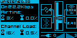

*The main/status screen (this example is showing the Airtime/Channel Load page - see below).*

The exact layout varies by board (screen shape, whether GNSS/Ethernet/ESP-NOW are present), but the same pieces show up everywhere there's a display:

### Status icons

Four small boxed icons, one per corner:

- **Host connection** (top-left) - a plain plug/cable icon showing whether a host (rnsd, Sideband, NomadNet, etc.) is currently attached, over whatever transport that happens to be. On boards with WiFi, this box becomes a WiFi icon instead once WiFi is turned on: in Station mode it shows searching vs. connected-to-your-network (with a small notch cut out of the icon if the WiFi link is up but no host is actually attached over it yet); in AP mode it shows waiting-for-client vs. a client connected
- **Radio** (top-right) - LoRa on/off. On `HAS_URNS` boards, this box shows a blinking envelope instead whenever the [LXMF Messenger](#lxmf-messenger) inbox has an unread message
- **Bluetooth** (bottom-left, boards with Bluetooth) - off / on / pairing / connected
- **GNSS, Ethernet, or ESP-NOW** (bottom-right, whichever the board actually has) - GNSS shows "GPS" plus OFF/ACQ/RDY; Ethernet shows link speed/duplex once connected, or "OFF"; ESP-NOW shows "ESP"/"NOW", filled in once it's the actively-claimed interface

### Q/S bars

Two small 7-segment bars next to the icons, both based on the *most recently received packet* (not a continuous ambient measurement, so they stay empty until the radio has actually received something):


*The Q and S bars, close up.*

- **Q (Quality)** - derived from that packet's SNR relative to the noise floor for the currently configured spreading factor
- **S (Signal)** - derived from that packet's RSSI

**S (Signal) bar ranges** - the RSSI floor/ceiling depend on the modem:

| Bars lit | SX127x / SX126x boards | SX1280 boards (2.4GHz) |
|---|---|---|
|  | ≤ -130.8 dBm | ≤ -102.2 dBm |
|  | -130.8 to -123 dBm | -102.2 to -97 dBm |
|  | -123 to -115.2 dBm | -97 to -91.8 dBm |
|  | -115.2 to -107.4 dBm | -91.8 to -86.6 dBm |
|  | -107.4 to -99.6 dBm | -86.6 to -81.4 dBm |
|  | -99.6 to -91.8 dBm | -81.4 to -76.2 dBm |
|  | -91.8 to -84 dBm | -76.2 to -71 dBm |
|  | ≥ -84 dBm | ≥ -71 dBm |

**Q (Quality) bar ranges** - based on SNR, but the floor shifts with the current Spreading Factor (a higher SF tolerates a weaker, more negative SNR for the same "full quality" reading), so there's no single fixed table. As a worked example, at **SF8**:

| Bars lit | SNR |
|---|---|
|  | ≤ -25 dB |
|  | -25 to -20.4 dB |
|  | -20.4 to -15.7 dB |
|  | -15.7 to -11.1 dB |
|  | -11.1 to -6.4 dB |
|  | -6.4 to -1.8 dB |
|  | -1.8 to 2.9 dB |
|  | ≥ 2.9 dB |

Each step up in Spreading Factor shifts every one of these thresholds another 2dB lower.

### Battery / Voltage

A small battery icon fills in segments by charge percentage, and switches to a plug icon while charging, once charged, or if no PMU/fuel gauge is detected at all. Next to it, a plain voltage readout is shown, which gets visually flagged once it drops to the board's low-battery threshold. Boards with no battery/PMU at all (just a plain resistor-divider VSENSE circuit) show that raw input voltage in this same spot instead, alternating with CPU temperature every few seconds on boards that also have a temperature sensor.

### Waterfall


*The waterfall strip, close up.*

A scrolling vertical strip - one new row pushed every screen refresh, oldest rows scrolling off the top:

- A plain line, its width proportional to ambient RSSI - the channel's noise floor while idle
- A full-width solid line - an actual packet's carrier was detected
- A checkerboard pattern - the radio is transmitting
- A dotted/tinted pattern - interference detected on the channel

The line width is scaled between a fixed lower and upper RSSI limit, clamped at either end rather than auto-ranging - so a completely empty line doesn't necessarily mean "no signal at all," just "at or below the lower limit." These limits are their own separate range, not the same one the [S bar](#qs-bars) uses:

| Boards | Lower limit | Upper limit |
|---|---|---|
| Most boards | -135 dBm | -60 dBm |
| LNA-equipped boards with a raised noise floor (Heltec T096, Heltec Wireless Tracker V2, Heltec T1) | -120 dBm | -40 dBm |

The LNA-equipped boards get a narrower, shifted-up range because their front-end's own noise floor already sits well above -135 dBm - without the shift, ambient idle noise would otherwise peg a fifth of the way up the graph instead of reading near zero.

On boards where ESP-NOW is the active interface instead of LoRa, there's no continuous ambient RSSI to trace, so the waterfall instead marks discrete RX/TX events as they happen.

### Airtime & Channel Load

A text page showing two duty-cycle-relevant stats, each as a short-term reading next to a long-term (rolling 1-hour) average:

- **Airtime** - the percentage of time this device itself has spent transmitting
- **Channel Load** - total channel occupancy: this device's own airtime plus other stations' activity the radio can hear, combined

Useful for keeping an eye on transmit-time limits in duty-cycle-regulated bands. On GNSS-equipped boards, this page alternates with a GNSS info panel (Fix/Satellites/Latitude/Longitude/Altitude/Time) every 10 seconds; see [GNSS Receiver Support](#gnss-receiver-support).

### Banner carousel

A small rotating strip cycles through a few more things every several seconds: a checks-passed/hardware-OK status graphic, the firmware version and build number, the device's network IP once WiFi or Ethernet is connected, and the system clock once it's been set (by an [RTC](#rtc-clock), GNSS, or the flasher's browser sync).

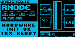

*The banner carousel showing "Hardware Init OK"/"TRX Ready" alongside the RNode ID and current date/time.*

---

## Navigation

RNode Firmware devices can be driven three ways, depending on what's populated on the board: the main button alone, a rotary encoder, or a paired BLE keyboard. All three drive the exact same on-screen menus - use whichever your board has.


*The main/status screen. A long-press of the main button from here opens the Settings menu.*

### Button-only navigation

Every display-equipped board can be driven with just its main button:

- **Short tap** - move the cursor forward one row/step
- **Quick double-tap** - move back
- **Brief hold (~0.5s), inside a menu** - select/confirm the currently highlighted row
- **Long press from the main screen** - opens one of several actions, depending on how long you hold. The longer you hold, the further down this list you go:

  1. **~1.5s - Messenger** (boards with LXMF Messenger)
  2. **~3s - Settings**
  3. **~5s - BT Pairing** (boards with Bluetooth)
  4. **~7s - Sleep** (boards with sleep support)

  A board only offers the tiers it actually supports - a board without Bluetooth just skips straight from Settings to Sleep, for example.

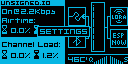

*While you hold the button from the main screen, a live indicator shows which action will fire if you release right now - keep holding to reach the next tier.*

The on-screen footer always shows which scheme is currently active.

### Rotary encoder navigation

On boards with a populated or DIY-wired encoder (MeshAdventurer-S3, ProMicro/FakeTec), turn/click works as an alternate to the button once enabled via **RNode Settings > Encoder**:

- **Turn** - move the cursor, or step a value up/down on an edit screen
- **Click** - select/confirm
- **Double-click, from the main screen** - opens Messenger directly (two short clicks within about 400ms)
- **Hold, from the main screen** - opens Settings
- **Hold, from anywhere inside Settings or Messenger** - commits any staged changes and exits straight back to the main screen, no matter how deep in the menu you are

The main button keeps working exactly as described above regardless of whether Encoder is turned on.

### BLE keyboard navigation

On `HAS_URNS`-class ESP32 boards with PSRAM, a paired BLE keyboard (see [BLE Keyboard Support](#ble-keyboard-support)) can drive the whole menu system too, in addition to being used for text entry.

**Global shortcuts** (work from almost anywhere, including the main screen):

| Key | Action |
|---|---|
|  | Open Settings, or close the currently open menu |
| <span style="margin:0 6px;">+</span> | Open Messenger, or close the currently open menu |
| <span style="margin:0 6px;">+</span>&nbsp;&nbsp;&nbsp;&nbsp; | Jump straight into a chat with the contact currently selected in Inbox/Bookmarks, or the one already open |
| Brightness Up/Down | Adjust display brightness |
| Volume Up/Down | Enable/disable the buzzer |
| Play/Pause | Toggle status-text marquee scrolling |

**Inside a menu:**

| Key | Action |
|---|---|
|  | Move the cursor between rows |
|  | Change a value on an edit screen |
|  | Select/confirm |
| &nbsp;&nbsp;&nbsp;&nbsp; | Go back / close (Backspace works the same way on most screens) |

**While composing text** (a Messenger reply, WiFi credentials, etc.):

| Key | Action |
|---|---|
|  | Send/confirm |
|  | Delete a character |
|  | Move around the on-screen keyboard grid or text cursor |
|  | Leave without sending |
| <span style="margin:0 6px;">+</span>&nbsp;&nbsp;&nbsp;&nbsp;<span style="margin:0 6px;">+</span> | Toggle EN/RU keyboard layout |

**In Dialog Mode** (the full-screen chat view - open it with Ctrl+A/F2 above, or the peer screen's own Dialog Mode row):

| Key | Action |
|---|---|
|      | From the compose box, switch focus to browsing message history and select a row (Page Up/Down jump several messages at a time, Home/End jump to the oldest/newest) |
|  | While browsing, return focus to the compose box (typing does this too) |
|  | While browsing, open the selected message full-screen |
|  | While browsing, delete the selected message (asks for confirmation) |
|  | Close the full-message view if one is open, otherwise leave Dialog Mode |

---

## RNode Settings Menu

Boards with a display and a main button get an on-device settings menu, opened with a long-press (3s) of the main button (or the equivalent encoder/BLE keyboard shortcut - see [Navigation](#navigation)):

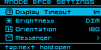 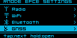

*The Settings list scrolls across multiple pages - which entries appear depends on what the board supports (the second page here adds Radio/WiFi/Bluetooth/GNSS).*

- **Display Timeout** - how long before the screen blanks

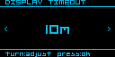

- **Brightness** - display contrast/backlight level: a 3-step OFF/DIM/BRIGHT pick on OLED boards (contrast has no perceptually useful continuous range on real hardware), or a finer 5-step OFF/LOW/MED/HIGH/MAX backlight level on TFT/color-LCD boards (T096/T114/etc.)
- **Orientation** - screen rotation, one of **0**, **90**, **180**, or **270** degrees. On boards with a 128x64 OLED panel, the RNode Settings Menu itself always renders in landscape while it's open, regardless of this setting - it switches back to whatever Orientation you've picked the moment you exit the menu. Boards with their own dedicated portrait-shaped menu layout (Heltec T096/T114) aren't affected by this and just use Orientation directly
- **Sound** - toggles the buzzer on/off (defaults off on boards where the buzzer is a DIY add-on most builds skip, e.g. ProMicro/FakeTec; otherwise defaults on) - see [Buzzer/Beeper Support](#buzzerbeeper-support)
- **LED Brightness** - boards with a NeoPixel/addressable status LED (e.g. the T-Beam family) can scale its brightness down without changing which color it shows - see [NeoPixel Status LED](#neopixel-status-led) for what each color means

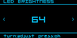

- **Encoder** - on boards with encoder support built in (MeshAdventurer-S3, ProMicro/FakeTec), tells the menu whether a physical rotary encoder is actually populated. Defaults off since it's either a PCB-provisioned-but-optional part (MeshAdventurer-S3) or a DIY add-on (ProMicro/FakeTec) rather than something guaranteed present. Changes the on-screen footer hint (turn/press vs. tap/hold) and gates whether the encoder's turn/press input is read at all - off, so a board with no encoder wired up can't misread floating-pin noise as phantom input - see [Rotary Encoder Support](#rotary-encoder-support) and [Navigation](#navigation)
- **WiFi** - mode/SSID/PSK (ESP32 boards with WiFi only) - see [WiFi](#wifi) for the full field list
- **Bluetooth** - MAC address, Bonds, and advanced pairing settings (boards with Bluetooth only) - see [Bluetooth](#bluetooth)
- **Ethernet** - link speed/duplex and static IP/netmask/gateway/DNS, or DHCP (MeshPoE-S3 only) - see [Wired Ethernet (W5500) Support](#wired-ethernet-w5500-support)
- **Hardware** - CPU temperature, voltages, network MACs, memory usage, and (on ProMicro/FakeTec) GPIO reassignment - see [Hardware](#hardware) below

Changes are staged in RAM as you navigate and are only written to EEPROM (with the matching device reboot where needed) when you commit and exit the menu - browsing settings never triggers spurious reboots or writes. Navigation and button presses get short tick/click buzzer feedback (unless Sound is off).

---

## URNS (microReticulum) Support

`HAS_URNS` boards (ESP32 boards with PSRAM) run a real, embedded Reticulum node - a portable C++ port of the [Reticulum](https://reticulum.network/) stack, not just a KISS modem passthrough - independent of any host. This uses [microReticulum](https://github.com/attermann/microReticulum) by Chad Attermann. URNS support is its own PlatformIO build environment per board (the `_urns` suffix) rather than something every build has - and not every one of those builds gets the full experience:

| Board | Messenger | On-device URNS menu | Status |
|---|---|---|---|
| MeshAdventurer-S3 | Yes | Yes | Hardware-validated |
| MeshPoE-S3 | Yes | Yes | Hardware-validated |
| Heltec WiFi LoRa 32 V4 | Yes | Yes | Hardware-validated |
| Heltec WiFi LoRa 32 V4 R8 | No | Yes | Not validated (untested R8 SKU) |
| LilyGO T-Beam 1W | Yes | Yes | Not validated (no hardware to test on) |
| LilyGO T-Beam Supreme | No | No - board has no Settings menu at all yet | Not validated (base board is; this URNS build isn't) |
| LilyGO T-Beam Supreme v3 | No | No - board has no Settings menu at all yet | Not validated (base board is; this URNS build isn't) |
| Aethernode-S3 | No - no button on this board at all | No - no button on this board at all | Not validated (base board is; this URNS build isn't) |

The Heltec V4 R8 and Aethernode-S3/T-Beam Supreme boards above still run the onboard Reticulum node itself (transport, path table, provisioning) - they just can't run the LXMF Messenger app (needs a menu to display it) or, for the last two, be configured from the device's screen at all - URNS runs with its compiled-in defaults on those, and settings changes need to come over KISS from a connected host instead.

It's configured under **RNode Settings > URNS**, on boards that have that menu:

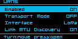 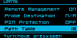 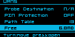

*The URNS settings list scrolls across three pages.*

- **Enabled** - master on/off switch for the onboard Reticulum node. Turning it off also takes Transport Mode, the LXMF Messenger, and everything else in this section with it
- **Transport Mode** - default off. Lets the onboard node relay other nodes' traffic and participate fully in path/announce propagation, instead of operating as a leaf/client-only node
- **Interface** (boards with ESP-NOW) - **LoRa** / **ESP-NOW** / **Both** - which transport(s) the onboard node's Reticulum stack actually uses
- **Link MTU Discovery** - default on. Lets Reticulum automatically negotiate a larger link MTU for faster transfers over links that support it
- **Remote Management** - default on, but harmless by default: nothing can actually manage the node remotely until its allow list (empty by default) is populated
- **Probe Destination** - default off. When enabled, lets the node reply to Reticulum probe requests from other tools (the same mechanism [Ping](#lxmf-messenger) and `rnprobe` use), so others can measure reachability/RTT to it
- **PIN Protection** - see [PIN protection](#pin-protection-optional) under LXMF Messenger
- **Path Table** - a live, read-only list of every destination this node currently has a path to
- **Free** - remaining free space on the onboard storage partition, broken down by what's using it

Changing Enabled, Transport Mode, Interface, Link MTU Discovery, or Remote Management requires a reboot to take effect, same as every other boot-only setting (staged, applied on **SAVE & EXIT**).

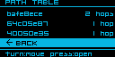 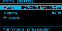 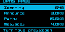

*Path Table (each entry shows its hop count; selecting one opens its full hash and remaining expiry), and the Free storage breakdown (Identity/Announce/Paths/Messages).*

---

## LXMF Messenger

Boards with `HAS_URNS` (currently MeshPoE-S3 and MeshAdventurer-S3) run a full onboard [LXMF](https://github.com/markqvist/LXMF) node and a bare-bones emergency messenger app on top of it - readable and usable entirely from the device's own screen, with no host PC or phone required.

Open it from **RNode Settings > Messenger**, or with a dedicated button-hold (1.5-3s, a shorter hold than the 3s Settings menu).

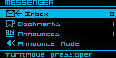

*The Messenger menu: Inbox, Bookmarks, Announces, Announce Node.*

**What it can do:**

- **Inbox** - received LXMF messages, stored on-device
- **Bookmarks** - saved peer addresses for quick access - see [Bookmarks](#bookmarks) below
- **Announces** - the last 8 `lxmf.delivery` announces heard on-air from other LXMF nodes (this firmware, [Sideband](https://github.com/markqvist/Sideband), [NomadNet](https://github.com/markqvist/NomadNet), etc.)
- **Announce Node** - immediately sends out an announce for your own LXMF delivery destination, rather than waiting for the next automatic one - useful right after setup, so other nodes can learn your address sooner
- **Send** - quick presets (e.g. Hi / Bye / SOS) or a free-text "Compose message", to any bookmarked, announced, or inbox contact
- **Ping** - measures round-trip time to any LXMF-reachable peer without sending an actual message (a raw link handshake, the same mechanism Reticulum's own `rnprobe` uses)
- **Sync to Prop** - manually pulls any deferred messages waiting on your active Propagation Node - see [Propagation Nodes](#propagation-nodes) below
- **Clear Conversation** - wipes a contact's message history from the device
- A blinking envelope icon replaces the normal radio-status icon on the main screen whenever there's an unread message

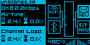

*The main screen's blinking envelope, shown here as a new message arrives.*

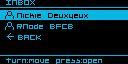 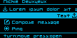 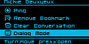

*Inbox, and the per-contact screen (recent messages, Send presets/Compose message/Ping at the top; scrolling down reaches Bookmark toggle/Clear Conversation/Dialog Mode).*

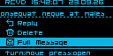 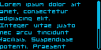 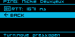

*Selecting a message offers Reply/Delete/Full Message; Ping shows round-trip time once it completes.*

If you reply to or ping someone whose announce never reached your node (for example, over a network that rate-limits incoming announce propagation), the Messenger automatically issues a path request and waits, rather than failing instantly - delivery still depends on some node between you and the peer having a cached announce.

### Composing text: tips and tricks

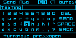

*The on-screen keyboard, used for composing messages, setting your display name, editing presets, and typing a bookmark's hash by hand.*

Move the highlight with a tap/turn and select it with a press/click - the same navigation as everywhere else (see [Navigation](#navigation)). A few keys aren't obvious from the grid alone:

- **Capitals** - tap **Shift** (the up-arrow key) to toggle it on for subsequent letters, like Caps Lock. On an encoder-equipped board, holding the encoder's button down while turning it inserts a one-off capital for whichever letter is highlighted, without toggling Shift at all.
- **Hidden symbols** - `.` `,` `?` `-` `/` and `@` each hide a second symbol on the same key. Hold the key for about a second to insert `:` `;` `!` `+` `\` or `#` instead. The same press-and-turn gesture used for one-off capitals does this too, on an encoder.
- **EN/RU layout switch** - hold **Shift** for about a second to flip the whole grid to a Cyrillic (ЙЦУКЕН) layout, arranged to match a real Russian keyboard. Hold it again (or press-and-turn Shift on an encoder, for an instant switch) to flip back.
- **Delete** - tap once per character, or hold it down to auto-repeat.
- Typing a bookmark's hash by hand (**Bookmarks > Add by Hash**) swaps in a shorter hex-only grid (0-9/A-F) instead of the full keyboard - there's no language switch there, since a hash is never Cyrillic.

A paired BLE keyboard bypasses this on-screen grid entirely and types directly - see [BLE keyboard navigation](#ble-keyboard-navigation) for its own Enter/Backspace/EN-RU shortcuts.

### Dialog Mode

With a paired BLE keyboard, **Dialog Mode** is a much quicker way to hold an actual back-and-forth conversation than the regular message flow: a full-screen chat view with the message history above and a compose box at the bottom, so you can read and reply in place instead of backing out to a separate screen for every message.

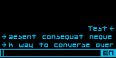

*Dialog Mode - message history above, composing a reply below.*

Open it with **Ctrl+A** or **F2** from Inbox, Bookmarks, or an already-open contact (jumps straight to that contact), or select **Dialog Mode** from a contact's own peer screen (scroll down past Send/Ping to find it). See [Navigation](#navigation) for the full set of Dialog Mode keys - browsing message history with Up/Down/PgUp/PgDn/Home/End, replying, deleting, and leaving with Escape.

### Bookmarks

Bookmarks are saved addresses for quick access from the Messenger, reached via **Bookmarks** on the Messenger main menu:

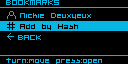

*The Bookmarks list - existing bookmarks, then Add by Hash, then BACK.*

#### Adding peers

If you know someone's destination hash but haven't received their announce yet - or are unable to, because their network rate-limits/restricts incoming announce propagation - they won't show up anywhere to select from. Select **Add by Hash** from the Bookmarks list instead and type in their 32-character hash directly. The screen has a **Type** field, defaulting to **LXMF** for a regular contact:

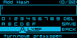

*Add by Hash, with Type set to LXMF - adds a regular contact.*

Once saved, the bookmark behaves exactly like one learned from a real announce - you can message it, and the Messenger's usual [auto path-request](#lxmf-messenger) behavior still applies if it can't resolve the peer's identity yet.

### Propagation Nodes

A Propagation Node is a store-and-forward LXMF relay: it holds messages for you when the recipient (or you) can't be reached directly, so you can sync them later. To use one, add it as a bookmark and mark it active.

**Adding a bookmark** - the same **Add by Hash** flow described in [Bookmarks](#bookmarks) above, except set the **Type** field to **Propagation** instead of the default LXMF:

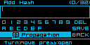

*Add by Hash, with Type set to Propagation.*

Propagation-type bookmarks show up in the Bookmarks list with a distinct broadcast-tower icon, so they're easy to tell apart from regular contacts at a glance.

**Making it active** - open the propagation node's bookmark and select **Set Active**. Only one can be active at a time; picking a different one just replaces it, no need to unset the old one first. This active node is what **Sync to Prop**, periodic background sync, and the Messenger Settings' "Propagate on Fail" option all use - none of them do anything until a node is set active.

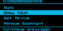

*A propagation node's own bookmark screen: Sync, Show Hash, Set Active, Remove Bookmark.*

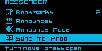

*Sync to Prop, on the Messenger main menu.*

**Syncing** - **Sync to Prop** (Messenger's main menu) or **Sync** (on the propagation node's own bookmark screen, which also makes that node active first if it wasn't already) triggers a manual pull. It shows "Syncing..." live, then "Synced N Msg(s)" or "Sync Failed"; selecting Sync to Prop with no active node set instead shows "Prop Not Set".

### PIN protection (optional)

The Messenger's identity and message store can be encrypted at rest behind a numeric PIN or passphrase, enabled via **RNode Settings > URNS > PIN Protection** (opt-in, default off). Once enabled, the device shows a lock screen at boot; message content and identity key material stay encrypted until unlocked. Turning protection off decrypts everything back to plaintext.

**There is currently no "forgot PIN" recovery.** If you enable PIN protection and lose the PIN, the only way back in is a full factory reset of the device's identity and message store - there is no partial recovery. Only enable this if you're comfortable with that tradeoff.

---

## Radio Settings

Available under **RNode Settings > Radio** on any board with a display and menu - not just `HAS_URNS` boards. It sits right under URNS in the menu, but configures the same underlying LoRa parameters a connected host already sets over KISS when using the device as a plain TNC modem, so it works whether or not the onboard Reticulum node is enabled.

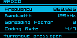 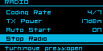

*The Radio settings list.*

- **Frequency** - center frequency, in MHz
- **Bandwidth** - channel bandwidth
- **Spreading Factor**
- **Coding Rate** - shown as 4/N
- **TX Power** - in dBm
- **Auto Start** - default on. Whether the radio starts automatically at boot using these settings; turn it off to leave the radio stopped until a host explicitly starts it, or until you use **Start Radio** below
- **Start Radio / Stop Radio** - a live, immediate action (not staged like the fields above) - manually starts or stops the radio right now with the currently configured parameters. Reads **HOST ATTACHED** instead if a connected host already owns the radio
- **Clear Settings** - immediately resets Frequency/Bandwidth/Spreading Factor/Coding Rate/TX Power back to "Unset" and stops the radio if it was running - no reboot needed to see it take effect

Frequency/Bandwidth/Spreading Factor/Coding Rate/TX Power/Auto Start are staged and only take effect after **SAVE & EXIT** (which reboots the device); Start Radio/Stop Radio/Clear Settings act immediately instead.

## ESP-NOW Interface

ESP32 boards with `HAS_ESPNOW` (currently MeshPoE-S3 and MeshAdventurer-S3) can expose a second, virtual "RNode" interface over [ESP-NOW](https://www.espressif.com/en/solutions/low-power-solution/esp-now) - a direct radio-to-radio protocol on the same WiFi silicon, alongside the real LoRa radio. A connected host sees it as an additional interface via the standard RNode Multi-Interface protocol. It's much faster and lower-latency than LoRa, at the cost of far shorter range.

Configure it under **RNode Settings > ESP-NOW**:

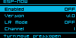

*ESP-NOW settings.*

- **Enabled** - default off
- **Version** - **v1.0** (classic, chunked framing) or **v2.0** (unfragmented). Locked to **v2.0 (URNS)** automatically whenever URNS's own Interface setting (below) uses ESP-NOW, since the onboard node only ever speaks the unfragmented v2 framing
- **LR Mode** - 802.11 Long Range PHY mode, trading bandwidth for range, independent of Version. Turning it on disables WiFi Remote, since the two can't share the radio at once - the menu requires an explicit confirmation before accepting that change
- **Channel** - the WiFi channel both ends need to agree on

The onboard [URNS](#urns-microreticulum-support) node can also use ESP-NOW instead of (or alongside) LoRa for its own traffic, via **RNode Settings > URNS > Interface**:

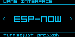

*Setting URNS's own Interface to ESP-NOW.*

## WiFi

ESP32 boards with WiFi are configured under **RNode Settings > WiFi**:

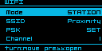 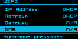 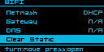

*The WiFi settings list scrolls across three pages.*

- **Mode** - **Off** / **Station** (join an existing network) / **AP** (the device hosts its own)
- **SSID** / **PSK** - network name and password
- **Channel** - only meaningful in AP mode. Shared with [ESP-NOW](#esp-now-interface) - both use the same underlying WiFi channel setting, so changing it here also moves ESP-NOW
- **IP Address** / **Netmask** / **Gateway** / **DNS** - DHCP by default; set any of them to switch that field to a static value
- **Clear Static** - resets IP Address/Netmask/Gateway/DNS back to DHCP in one step

All fields are staged and take effect on **SAVE & EXIT** (which reboots the device).

**WiFi and ESP-NOW's LR Mode can't be used at the same time** - they can't share the radio. Turning LR Mode on (under **RNode Settings > ESP-NOW**) disables WiFi entirely, with a confirmation prompt before it's accepted; plain ESP-NOW (LR Mode off, either Version) coexists with WiFi normally.

## Buzzer/Beeper Support

Boards with a populated (or DIY-added) buzzer get audible feedback: a boot melody, menu navigation ticks/clicks, Bluetooth pairing/connect chirps, and a chirp on RNS host link connect/disconnect (serial, BLE, or WiFi - whichever the host is currently attached over). Muted entirely via **RNode Settings > Sound**, or - on boards with [BLE Keyboard Support](#ble-keyboard-support) - directly from a paired keyboard's Volume Up/Down keys, without opening any menu (see [Navigation](#navigation)).

## Rotary Encoder Support

Boards with a populated or DIY-wired rotary encoder (MeshAdventurer-S3, ProMicro/FakeTec) can use it as an alternate to the main button, once enabled via **RNode Settings > Encoder**. See [Navigation](#navigation) for how it drives the menus.

## NeoPixel Status LED

On boards with a NeoPixel/addressable status LED, its color indicates what the radio is currently doing:

| Color | Meaning |
|---|---|
| <span style="display:inline-block;width:12px;height:12px;border-radius:50%;background:#00ff00;"></span> Green | Receiving a packet over LoRa (RX) |
| <span style="display:inline-block;width:12px;height:12px;border-radius:50%;background:#0000ff;"></span> Blue | Transmitting a packet over LoRa (TX) |
| <span style="display:inline-block;width:12px;height:12px;border-radius:50%;background:#ffff00;"></span> Yellow flash | Receiving a packet over [ESP-NOW](#esp-now-interface) (RX) |
| <span style="display:inline-block;width:12px;height:12px;border-radius:50%;background:#ff5000;"></span> Orange flash | Transmitting a packet over [ESP-NOW](#esp-now-interface) (TX) |
| <span style="display:inline-block;width:12px;height:12px;border-radius:50%;background:#900070;"></span> Purple | Interference detected on the channel |
| <span style="display:inline-block;width:12px;height:12px;border-radius:50%;background:#400000;"></span> Dim red glow | Airtime/duty-cycle limit reached - TX is being held back |
| <span style="display:inline-block;width:12px;height:12px;border-radius:50%;background:#ffffff;border:1px solid #888;"></span> White, slow breathing pulse | Idle - radio ready and waiting |
| <span style="display:inline-block;width:12px;height:12px;border-radius:50%;background:#ff0000;"></span> Red, breathing pulse | Radio not ready/not configured |
| <span style="display:inline-block;width:12px;height:12px;border-radius:50%;background:#ffffff;border:1px solid #888;"></span> White, solid | Fatal boot error |

LoRa and ESP-NOW are independent interfaces that can both be active at once - green/blue and yellow/orange can appear close together rather than one replacing the other.

Its overall brightness is independently controlled by **LED Brightness** (see [RNode Settings Menu](#rnode-settings-menu)), without changing which color is shown.

## Hardware

Read-only diagnostic info under **RNode Settings > Hardware** - what's shown depends on what the board actually has:

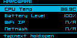 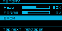

*Hardware, and its Memory submenu.*

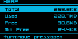 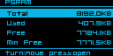

*Heap and PSRAM detail screens: Total/Used/Free/Min Free.*

- **CPU Temp** - ESP32-S3 and nRF52 boards only
- **Input Voltage** - on boards with a resistor-divider VSENSE circuit, opens a **Voltage Divider** ratio field (staged, applied immediately - no reboot needed). Real resistor tolerances drift from the nominal divider math, so this lets you correct the reading against a multimeter if it's consistently off, without needing a firmware change

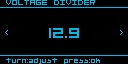

*The Voltage Divider field, opened from Input Voltage.*

- **Battery Level** / **Battery Voltage** - read "N/A" on boards with no battery monitoring. Boards without a real VSENSE divider on the battery line (e.g. ProMicro/FakeTec) get a separate battery-scale percentage field here instead, for the same kind of per-unit calibration
- **WiFi IP** / **Netmask** - "N/A" when not connected
- **WiFi** - the WiFi radio's MAC address
- **Eth** - the Ethernet MAC address (MeshPoE-S3 only)
- **GPIO** - DIY-only, currently only applicable to ProMicro/FakeTec. On boards where the builder solders peripherals to whichever spare pad they used, lets you reassign a peripheral - the buzzer, and the encoder's Up/Down/Press pins - to a different physical GPIO from a short list of genuinely free pins. Refuses to assign the same pin to two peripherals at once. Takes effect on the next boot

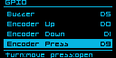

*GPIO reassignment (ProMicro/FakeTec only).*

- **Memory** - opens a live breakdown for Heap, and PSRAM on boards that have it: **Total**, **Used**, **Free**, and (ESP32 boards only) **Min Free** - the lowest free heap seen since boot, useful for spotting a slow leak that a single snapshot wouldn't show
- **Node Uptime** - time since last boot, as HH:MM:SS

Bluetooth's own MAC address is shown on the [Bluetooth](#bluetooth) screen instead of here.

## Bluetooth

Boards with Bluetooth are configured under **RNode Settings > Bluetooth**:

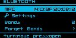

*The Bluetooth screen: MAC address, Settings, Bonds, Forget Bonds.*

- **MAC** - the device's Bluetooth address
- **Settings** - see below
- **Bonds** - how many devices are currently bonded (paired)
- **Forget Bonds** - unpairs everything, with a confirmation prompt

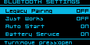

*Bluetooth Settings.*

- **Legacy Pairing** (ESP32 boards) - default off. Falls back to the older BLE pairing method for clients that don't support modern Secure Connections pairing
- **Just Works** (ESP32 boards) - default off. Opt-in, lower-security pairing (no PIN/MITM protection) for clients that can't do authenticated pairing at all
- **Auto Start** (ESP32 boards) - default off. Whether Bluetooth powers on automatically at boot, rather than waiting for it to be turned on manually
- **Battery Service** (Experimental) - exposes the device's battery level over the standard BLE Battery Service, so phones/OSes can show it in their own Bluetooth device list. Most mobile OSes don't surface this out of the box, so don't expect to see it without extra support on the client side

## Bluetooth/BLE Pairing

This covers pairing the device itself to a host - a phone or computer running Sideband, NomadNet, or any other Reticulum/KISS client over Bluetooth. (Pairing a BLE keyboard *to* the device is the reverse direction - see [BLE Keyboard Support](#ble-keyboard-support).)

**Manually arming pairing isn't required.** There are two ways to start:

- **On the device** - hold the main button for about 5 seconds from the main screen (the **BT Pairing** tier - see [Navigation](#navigation) for the full hold-tier list)
- **From the other side** - just start pairing from your phone or computer's own Bluetooth settings. The device accepts an incoming pairing request on its own and shows the same passcode screen automatically, even if you never touched the button first

Either way, the screen shows **PAIRING** along with a live 6-digit passcode - confirm it matches what your phone or computer is showing to complete the pairing:

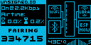

*The on-device pairing screen, with its 6-digit passcode.*

The passcode is randomly generated fresh each time, and the pairing window closes on its own after about 35 seconds if nothing completes it.

**From the RNode Flasher web tool** - while connected over USB, flasher.rns.moscow's **Node Configuration > BT** tab can also arm pairing remotely and displays the same live passcode in the browser - useful if you'd rather not use the device's own controls, or the board has no display:

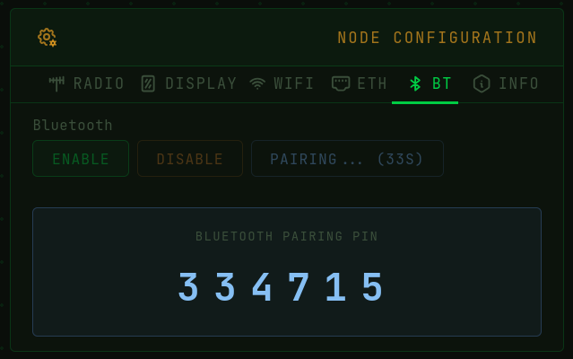

*Arming pairing and reading the passcode from the RNode Flasher web tool.*

If a client can't complete the modern passcode-confirm flow, see **Legacy Pairing** and **Just Works** under [Bluetooth](#bluetooth) above.

## BLE Keyboard Support

Boards with URNS and Messenger support can pair with a standard BLE HID keyboard and use it for menu navigation and text entry (for example, composing Messenger replies) instead of the button/encoder. This isn't limited to dedicated keyboards - BLE TV remotes with an integrated keyboard (the small QWERTY remotes bundled with many Android TV/streaming boxes) work the same way, since they advertise as the same HID keyboard device class.

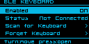

*RNode Settings > Bluetooth > BLE Keyboard.*

**To pair and connect a keyboard:**

1. Open **RNode Settings > Bluetooth > BLE Keyboard** and set **Enabled** to ON
2. Select **Scan for Keyboard** - the device lists nearby HID-advertising keyboards as it finds them
3. Select yours from the list, then confirm on the PAIR/CANCEL screen
4. A live status shows Pairing... then Paired! (or Failed, if it didn't complete) and auto-dismisses on success
5. **Status** on the BLE Keyboard screen reflects the current state: Disabled / Not Paired / Not Connected / Connected

Once paired, the device automatically reconnects to that one keyboard every time Bluetooth powers on - no re-pairing needed. **Forget Keyboard** removes just that pairing (with a confirmation prompt) without affecting any other Bluetooth bonds, like a paired phone.

See [Navigation](#navigation) for the full key mapping once connected.

## Wired Ethernet (W5500) Support

MeshPoE-S3 only. A W5500 Ethernet controller provides a wired, power-over-Ethernet-capable network link as an alternative or complement to WiFi. DHCP is used by default (with an automatic `rnode-xxxx` hostname derived from the device's Bluetooth MAC); static IP/netmask/gateway/DNS can be set instead via **RNode Settings > Ethernet**. The main screen shows a link-state icon and a rotating page with the current Ethernet IP.

## GNSS Receiver Support

Boards with a built-in or wired GNSS module report position, altitude, satellite count, and fix status. Available on:

- Heltec Mesh Node T096 (built-in UC6580)
- Heltec T114 (Quectel L76K)
- MeshAdventurer-S3 (AT6558)
- Heltec WiFi LoRa 32 V4 (Quectel L76K)

View live GNSS data and toggle it on/off under **RNode Settings > GNSS**. On the main screen, an airtime/statistics panel alternates with a GNSS info panel every 10 seconds on boards that have both.

- **Enabled** - immediate-commit toggle; powers the GNSS module on/off live, no reboot needed
- **Update Interval** (boards that can gate GNSS power) - how often the receiver wakes to get a fresh fix, trading position freshness for power: **Continuous**, or a duty-cycled 5/15/60-minute preset (some boards also offer 1 minute). Continuous keeps the receiver always on
- **Duty State** - read-only: **ACTIVE** (powered, acquiring), **HOLD** (about to sleep), or **SLEEP** (powered down between intervals). On a board that can't duty-cycle, this just reads ACTIVE (or OFF when GNSS is disabled)
- **Fix** / **Satellites** / **Latitude** / **Longitude** / **Altitude** - read-only, from the current fix
- **Time** - read-only UTC time from the receiver. This populates independently of Fix/position - a GNSS receiver typically locks time before it ever gets a position fix, so Time being valid while Fix/Satellites still read zero tells you the receiver and its NMEA parsing are working fine, and what's missing is just sky visibility. The first time GNSS gets a valid time reference after boot, the device automatically seeds its system clock from it, with no manual sync needed - see [RTC Clock](#rtc-clock) for why a correct clock matters. This seeding happens once per boot, not continuously; on boards with a real RTC chip, the RTC takes priority and this is just a fallback
- **Timezone** - the same display-only UTC offset field as [RTC Clock](#rtc-clock)'s Timezone (shared setting, editable from either screen) - relevant here since GNSS is a real time source in its own right on boards with no RTC chip at all
- **Diagnostics** (Heltec T096, Heltec T114, MeshAdventurer-S3) - a verbose page for troubleshooting reception, not needed for normal use:
  - Module (chip identity), Fix Quality, Fix Mode, HDOP/PDOP/VDOP (dilution of precision), Speed, Course, Date
  - Sats Used vs. **Sats In View** - Sats Used is what the current fix is actually built from; Sats In View opens a live per-satellite list (PRN/elevation/azimuth/SNR) so you can tell a genuinely empty sky from a receiver that sees satellites but can't get a good enough fix from them
  - Checksum Passed/Failed/Rate, and Chars (raw bytes received) - for confirming the serial link between the MCU and GNSS module itself is healthy, independent of antenna/sky conditions
  - On boards that can duty-cycle: Duty State (same as the main page), Lock Count/Fail Count (successful vs. failed re-acquisitions since boot), Predicted (next scheduled wake), and Wake Countdown (counts down only while actually in SLEEP)
- **Show Banner** - a one-shot action (not a toggle, and not reversible without a reboot): pins the GNSS info panel on the main screen full-time, replacing its normal alternation with the airtime panel

## RTC Clock

Boards with a real-time clock (currently MeshPoE-S3 and MeshAdventurer-S3) keep the date and time under **RNode Settings > RTC**:

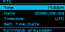 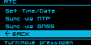

*The RTC screen: current Time/Date/Timezone, and the Set/Sync actions.*

- **Time** / **Date** - read-only, shown in local time (shifted by Timezone below)
- **Timezone** - a display-only UTC offset; changes how Time/Date are shown here, takes effect immediately
- **Set Time/Date** - a sequential Year/Month/Day/Hour/Minute/Second editor that writes straight to the RTC chip on confirm, no reboot needed
- **Sync via NTP** (ESP32 boards with WiFi or Ethernet) - fetches the time over the network. Briefly blocks with a live "Connecting.../Resolving.../Syncing..." status
- **Sync via GNSS** (boards with GNSS) - sets the clock from the GNSS receiver's own NMEA time, using whatever fix it already has - if you haven't got a GNSS fix yet, this won't have anything to sync from

You can also set the clock from a browser, without opening any on-device menu: connect the device to [flasher.rns.moscow](https://flasher.rns.moscow) over USB and use its **Sync from Browser** (uses your computer's clock) or **Sync from NTP** button.

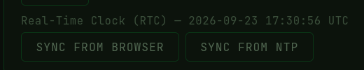

*The RTC panel on flasher.rns.moscow.*

**Why this matters:** having a correct clock isn't required for the radio or Reticulum routing to work - packets still send and relay fine either way. But on `HAS_URNS` boards, this clock (RTC if present, GNSS otherwise) is exactly what feeds the onboard Reticulum node's sense of "now", which shows up in two places: **LXMF message timestamps** (a wrong clock means messages show the wrong time, or all cluster around 1970-01-01 if the clock was never set at all), and less obviously, **path/announce record expiry** - the Path Table's own entries are aged out based on this same clock, so a badly wrong one can make entries look expired when they aren't, or never expire when they should.

## Environment Sensor Support

Boards with I2C support can have an environment sensor connected to them, auto-detected at boot - no configuration needed. Currently supported:

- **Bosch BMP280** - temperature + pressure
- **Bosch BME280** - temperature + humidity + pressure


*The Sensors screen, reading a live BME280.*

Values are shown read-only under **RNode Settings > Sensors** (Humidity reads "N/A" on a BMP280, which has no humidity element) and can also be queried over the KISS serial protocol.

## OTA Firmware Update Support

Network-based firmware updates, available on boards with sufficient flash for two app partitions (currently MeshPoE-S3 and MeshAdventurer-S3, both `HAS_OTA`). No USB cable needed - updates install over whatever network connection the device already has (WiFi or, on MeshPoE-S3, Ethernet).

**On the device**, under **RNode Settings > F/W Update**, a status page shows the current and latest available version and lets you trigger an install directly from the screen.

 

*The on-device F/W Update screen, and its Update/Cancel confirmation.*

Both the on-device screen and the update page below check for and pull new firmware straight from [flasher.rns.moscow](https://flasher.rns.moscow), the same site the [web flasher](#getting-firmware-onto-a-device) is hosted on.

**From a browser**, each `HAS_OTA` device also runs its own update page at:

```
http://<device-ip>:8080/
```

(find the device's IP under **RNode Settings > WiFi** or **> Ethernet**). The page shows the device's short ID, current firmware version, and live radio/host-connection status badges, and offers two ways to update:


*The :8080 update page - status badges, a caution banner while the radio/a host is active, Check for Update/Install Latest, and manual upload.*

- **Install Latest** - checks flasher.rns.moscow and only enables itself once a genuinely newer build is available there; installs over the network with a progress indicator
- **Manual upload** - pick a `.bin` file from your own machine and upload it directly to the device, with a live progress bar. Bare OTA `.bin` files for every `HAS_OTA` board are published at [flasher.rns.moscow/firmware/classic/latest/OTA/](https://flasher.rns.moscow/firmware/classic/latest/OTA/), if you'd rather download one yourself than rely on Install Latest

If the radio or a host is actively connected when you start an update, the page shows a caution prompt before proceeding, since flashing interrupts normal operation. A recovery button-hold at power-on can force-boot the previous firmware partition if a new install doesn't come up cleanly.

## Promiscuous LoRa Mode Support / Packet Analyzer

A LoRa packet monitor mode (`CMD_PROMISC` over KISS): instead of the normal RNode packet framing/reassembly, every raw LoRa packet received is passed straight to the host along with its RSSI/SNR, letting a connected tool observe raw on-air traffic rather than just Reticulum-framed data intended for this node.

[**LoRaMon-Web**](https://loramon.rns.moscow) is a browser-based capture/decode tool built for this mode - connect an RNode over USB (Web Serial) or Bluetooth (Web Bluetooth), no install required, and it puts the device into promiscuous mode and streams captured packets live, with a hex+ASCII view and per-packet RSSI/SNR/size. It decodes and classifies traffic from three protocols - Reticulum (e.g. tagging LXMF announces), Meshcore, and Meshtastic - rather than just showing raw bytes. It's hosted at [loramon.rns.moscow](https://loramon.rns.moscow); for self-hosting, the source is at [git.rns.moscow/deuxyeux/LoRaMon-web](https://git.rns.moscow/deuxyeux/LoRaMon-web).


*LoRaMon-Web monitoring a connected RNode.*


*The device's own screen switches to this LoRaMon banner while a LoRaMon-Web session is actively running against it, so anyone holding it can tell it's in capture mode rather than operating normally.*

Starting monitoring lets you set the frequency, bandwidth, spreading factor, coding rate, and sync word to capture on - independently of whatever the device is normally configured for. This is a live, temporary change (not written to the device's EEPROM) that disrupts any real traffic on a node actually in use until you stop monitoring or disconnect, at which point its original configuration is restored automatically.

---

## WebSocket & TCP/IP KISS Interface

Boards with WiFi (or, on MeshPoE-S3, Ethernet) expose the exact same KISS byte stream normally carried over USB serial as two additional network transports. Both come up automatically the moment the network connection is up - no pairing, no separate menu toggle to turn them on:

- **Raw TCP, port 7633** - for desktop Reticulum and any other tool that can open a plain TCP socket. Point RNS's `TCPClientInterface` at the device's IP address and this port, exactly as you'd point a serial-based interface at a USB port - it's the same KISS framing (FEND/FESC-escaped), just carried over TCP instead of a serial line
- **WebSocket, port 7634** - the identical KISS byte stream, wrapped for browser-based tools that can't open a raw TCP socket at all (browser sandboxing blocks that). This is what lets a tool like [LoRaMon-Web](#promiscuous-lora-mode-support-packet-analyzer) reach a network-connected device instead of requiring a USB or Bluetooth connection

**Only one client total** can be connected across both at any given time - a second connection attempt (TCP or WebSocket, doesn't matter which) is refused outright while the first is still attached, rather than kicking it off. This is because both transports feed the same underlying KISS parser a serial connection would, and two hosts writing to it at once would interleave and corrupt both streams. Disconnect (or let the existing connection time out) before a second tool can connect.

To find the device's IP address, check **RNode Settings > WiFi** (or **> Ethernet** on MeshPoE-S3), or the [banner carousel](#banner-carousel) on the main screen.

---

## Building From Source

The source is at [git.rns.moscow/deuxyeux/RNode_Firmware](https://git.rns.moscow/deuxyeux/RNode_Firmware). This fork builds with [PlatformIO](https://platformio.org/):

```
pio run -e <env> -t upload
```

This builds and flashes in one step. Environment names come from `platformio.ini` - list them with:

```
grep '^\[env:' platformio.ini
```

Upload port auto-detects; pass `--upload-port <port>` if it picks the wrong one.

A few boards (older extended-LED variants, `mega2560`) don't have a PlatformIO environment yet and still build via the classic `arduino-cli`/`Makefile` flow:

```
make firmware-<board>     # build - do this last, immediately before upload
make upload-<board>       # flash over USB serial
```

### Clearing "Firmware Corrupt" after a manual flash

The web flasher sets the device's firmware hash automatically. A manual PlatformIO/`make` flash does not - the device will report **Firmware Corrupt** until the hash is set. Using [`rnodeconf`](https://github.com/markqvist/Reticulum) (installed via `pip install rns`), read the firmware's actual hash back from the device and write it in as the target:

```
rnodeconf -p <port> -L                 # prints "The actual firmware hash is: <hex>"
rnodeconf -p <port> -H <hex from above>
```

If the board is brand new and has never been provisioned (blank EEPROM - typical for a freshly-assembled DIY board), provision it first with `rnodeconf -p <port> -r`, then set the hash as above.

---

## Attribution & Credits

This firmware builds on the work of a lot of people beyond this fork's own contributors.

**Original firmware and protocols**

- [Mark Qvist](https://unsigned.io/) - author of the original [RNode_Firmware](https://github.com/markqvist/RNode_Firmware), and creator of the [Reticulum](https://reticulum.network/) network stack and [LXMF](https://github.com/markqvist/LXMF) message format this firmware implements. The LoRa radio subsystem itself is untouched from upstream - it's still Mark's original SX127x/SX126x/SX128x driver code.

**Embedded Reticulum/LXMF stack** (see [URNS (microReticulum) Support](#urns-microreticulum-support))

- [Chad Attermann](https://github.com/attermann) - [microReticulum](https://github.com/attermann/microReticulum) (the C++ Reticulum port this firmware's onboard node runs on) and [microStore](https://github.com/attermann/microStore) (its key-value storage backend)
- [Torlando Tech LLC](https://github.com/torlando-tech) - [microLXMF](https://github.com/torlando-tech/microLXMF), the LXMF implementation layered on top of microReticulum

**Community device designs** (see [Supported Devices](#supported-devices))

- [Nickie Deuxyeux](https://git.rns.moscow/deuxyeux) - MeshPoE-S3, MeshAdventurer-S3
- aetherlab LZ1SWE - [Aethernode](https://github.com/ahedproductions/aethernode), [Aethernode-S3](https://github.com/ahedproductions/aethernodeS3)
- Frequency Labs ([chrismyers2000](https://github.com/chrismyers2000)) - [MeshAdventurer](https://github.com/chrismyers2000/MeshAdventurer)
- gargomoma, ShimonHoranek, lupusworax - [FakeTec / ProMicro](https://github.com/gargomoma/fakeTec_pcb)
- [NanoVHF](https://github.com/NanoVHF) - [DIY-V1](https://github.com/NanoVHF/Meshtastic-DIY/)

**Reference designs** - pin mappings and hardware behavior for the boards in this fork with no physical unit to test against yet (see [Supported Devices](#supported-devices)) were cross-checked against these projects' own variant/board definitions rather than guessed:

- [Meshtastic](https://meshtastic.org/)
- [MeshCore](https://github.com/ripplebiz/MeshCore)

**Third-party libraries**

- Adafruit - GFX Library, BusIO, NeoPixel, SSD1306, SH110X, ST7735/ST7789, BME280, BMP280, and Unified Sensor libraries
- [Benoit Blanchon](https://github.com/bblanchon) - ArduinoJson
- [Hideaki Tai](https://github.com/hideakitai) - MsgPack
- [Mikal Hart](https://github.com/mikalhart) - TinyGPSPlus
- [Lewis He](https://github.com/lewisxhe) - XPowersLib
- [Markus Sattler](https://github.com/links2004) - WebSockets
- [Jean-Marc Zingg](https://github.com/ZinggJM) - GxEPD2
- [Rhys Weatherley](https://github.com/rweather) - the original Crypto library microReticulum's own dependency is forked from
- Julian Seward - bzip2/libbzip2, vendored inside microReticulum for LXMF Resource decompression
- Espressif and the Arduino-ESP32 core team, and Adafruit's nRF52 core team, for the underlying platforms this firmware builds on

**Fonts used on-device**

- Sebastian Weber - Picopixel, the small status-box/icon-label font
- Orgdot ([orgdot.com/aliasfonts](https://www.orgdot.com/aliasfonts/)) - Org_01, the main menu/UI font. Its Cyrillic block is a separate addition, converted from the public-domain X11 "5x7" font (Janne V. Kujala / Markus Kuhn's `ucs-fonts`, `misc-fixed` 7px)
- Scott Fial ([fial.com/~scott/tamsyn-font](http://www.fial.com/~scott/tamsyn-font/)) - Tamsyn 6x12
- YukiPixels ([yukipixels.itch.io/boldpixels](https://yukipixels.itch.io/boldpixels)) - BoldPixels, rasterized for the large BLE pairing PIN digits, licensed [CC BY-SA 4.0](https://creativecommons.org/licenses/by-sa/4.0/)

**Assets**

- [Kenney](https://kenney.nl/) - the Input Prompts icon pack (CC0), used for the keyboard key icons in this manual's [Navigation](#navigation) section
- Mark Qvist / [unsigned.io](https://unsigned.io/) - the RNode logo used at the top of this manual
- Zenith ([RFnexus](https://github.com/RFnexus/)) - the Heltec T114's boot logo, from [rns.recipes](https://rns.recipes)
